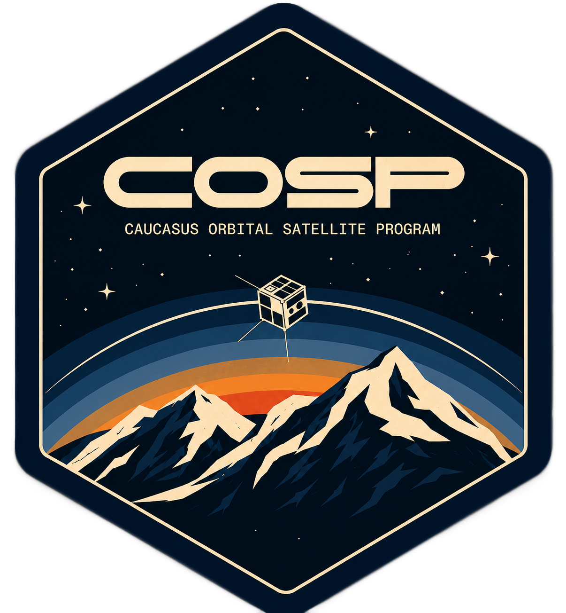

  

<h1 align="center">COSP</h1>

  Caucasus Orbital Satellite Program

# About project

The Caucasus Orbital Satellite Program (COSP) is a collaborative engineering project focused on robotics, aerospace systems, and satellite simulation technologies. The project serves as a platform for research, learning, and experimentation in aerospace engineering.

## Purpose
COSP aims to research, design, and prototype satellite systems while advancing skills in robotics, aerospace engineering, and simulation. The goal is to provide a structured environment where students and enthusiasts can contribute to the design, analysis, and development of orbital satellite technologies.

## Status
Early research and planning phase.

## Goals
- Define project architecture
- Collect technical documentation
- Develop first prototype
- Establish simulation and testing frameworks

## Technologies
TBD

## Contributions
Contributors are welcome to participate in research, simulations, and prototype development. All contributions should follow the project guidelines once established.
